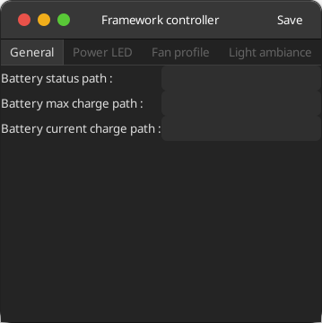
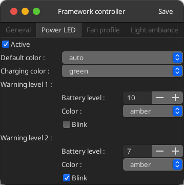
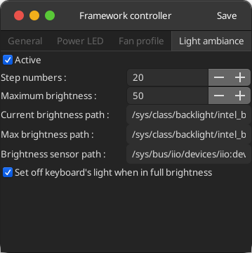

# fw-ctrl

This is a Python service for Linux that drives the Framework Laptop's :

- fan speed according to a configurable speed/temp curve

- screen brightness according to the illuminance sensor for desktop tha tmiss this functionnality

- the power led color according to the battery status.

It dispose of a GUI configuration tool.

For fan and lec control it uses [fw-ectool](https://github.com/DHowett/fw-ectool) to change parameters in FrameWork's embedded controller (EC).

Each control can be disabled is found unnecessary.

### Fan control

Its default configuration targets medium silent fan operation, but it's easy to configure it for a different comfort/performance trade-off.
Its possible to specify two separate fan curves depending on whether the Laptop is charging/discharging.

### Screen brightness control

Screen brightness is set from 0 to a configurable max, sensibility is set as a number of step that divide from zero to the max brightness.

### Power Led control

Led behaviour is by default, green when charging, amber when discharging and under 10 percent. Two alert step are provided with possibility of blink.

### Acknowledment

Fan control and installation script is base upon the [fw-fanctrl](https://github.com/TamtamHero/fw-fanctrl) project made by TamtamHero

# Install

## Dependancies

This tool depends on `lm-sensors` to fetch CPU temperature:

```
sudo apt install lm-sensors
yes | sudo sensors-detect
```

To communicate with the embedded controller the `fw-ectool` is needed. You can either use the pre-compiled executable of `fw-ectool` in this repo, or recompile one from [this repo](https://github.com/DHowett/fw-ectool) and copy it in `./bin`.

Then run:

```
sudo ./install.sh
```

This bash script is going to create and enable a service that runs this repo's main script, `ctrl.py`.
It will copy `ctrl.py` (to an executable file `fw-ctrl`) and `./bin/ectool` to `/usr/local/bin` and create a config file in `/home/<user>/.config/fw-ctrl/config.json`.

It will also install a desktop shortcut for utility `fw-ctrlui`.

# Update

To install an update, you can just pull the latest commit on the `main` branch of this repository, and run the install script again.
It will overwrite the config file, so you might want to back it up if you have a custom one !

# Uninstall

```
sudo ./install.sh remove
```

# Configuration

There is a single `config.json` file where you can configure the service. You need to run the install script again after editing this config, or you can directly edit the installed config at `/home/<user>/.config/fw-fanctrl/config.json` and refresh the service with:

```
fw-ctrl refresh
```

You can also use the ``fw-ctrlui`` utility called "Framework controller" in the desktop menu.








For more infromation on fan configuration and profile, please report to [fw-fanctrl](https://github.com/TamtamHero/fw-fanctrl) documentation.
